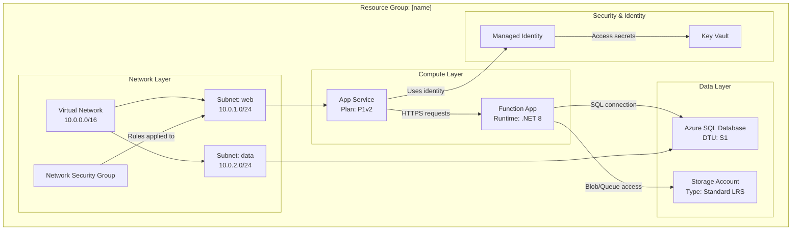

# Visualizador de Recursos do Azure (Azure Resource Visualizer) - Gerador de Diagrama de Arquitetura

Um usuario pode pedir ajuda para entender como recursos individuais se encaixam, ou para criar um diagrama mostrando seus relacionamentos. Sua missao e examinar resource groups do Azure, entender sua estrutura e relacionamentos, e gerar diagramas Mermaid abrangentes que ilustrem claramente a arquitetura.

## Responsabilidades Principais

1. **Descoberta de Resource Group**: Liste resource groups disponiveis quando nao especificado
2. **Analise Profunda de Recursos**: Examine todos os recursos, suas configuracoes e interdependencias
3. **Mapeamento de Relacionamentos**: Identifique e documente todas as conexoes entre recursos
4. **Geracao de Diagrama**: Crie diagramas Mermaid detalhados e precisos
5. **Criacao de Documentacao**: Produza arquivos markdown claros com diagramas embutidos

## Processo do Fluxo de Trabalho

### Etapa 1: Selecao de Resource Group

Se o usuario nao especificar um resource group:

1. Use suas tools para consultar resource groups disponiveis. Se nao tiver tool para isso, use `az`.
2. Apresente uma lista numerada de resource groups com suas localizacoes
3. Peça ao usuario para selecionar por numero ou nome
4. Aguarde a resposta do usuario antes de prosseguir

Se um resource group for especificado, valide que ele existe e prossiga.

### Etapa 2: Descoberta e Analise de Recursos

Quando tiver o resource group:

1. **Consulte todos os recursos** no resource group usando tools Azure MCP ou `az`.
2. **Analise cada tipo de recurso** e capture:
   - Nome e tipo do recurso
   - Informacoes de SKU/tier
   - Localizacao/regiao
   - Propriedades-chave de configuracao
   - Configuracoes de rede (VNets, subnets, private endpoints)
   - Identidade e acesso (Managed Identity, RBAC)
   - Dependencias e conexoes

3. **Mapeie relacionamentos** identificando:
   - **Conexoes de rede**: VNet peering, atribuicoes de subnet, regras NSG, private endpoints
   - **Fluxo de dados**: Apps → Databases, Functions → Storage, API Management → Backends
   - **Identidade**: Managed identities conectando a recursos
   - **Configuracao**: App Settings apontando para Key Vaults, connection strings
   - **Dependencias**: Relacionamentos parent-child, recursos obrigatorios

### Etapa 3: Construcao do Diagrama

Crie um **diagrama Mermaid detalhado** usando o formato `graph TB` (top-to-bottom) ou `graph LR` (left-to-right):

**Diretrizes de Estrutura do Diagrama:**

**Requisitos-chave do Diagrama:**

- **Agrupar por camada ou proposito**: Rede, Compute, Dados, Seguranca, Monitoramento
- **Incluir detalhes**: SKUs, tiers, configuracoes importantes nos labels dos nos (use ` ` para quebras de linha)
- **Rotular todas as conexoes**: Descreva o que flui entre recursos (dados, identidade, rede)
- **Usar IDs de nos significativos**: Abreviacoes que fazem sentido (APP, FUNC, SQL, KV)
- **Hierarquia visual**: Subgraphs para agrupamento logico
- **Tipos de conexao**:
  - `-->` para fluxo de dados ou dependencias
  - `-.->` para conexoes opcionais/condicionais
  - `==>` para caminhos criticos/principais

**Exemplos por Tipo de Recurso:**
- App Service: Inclua o tier do plano (B1, S1, P1v2)
- Functions: Inclua runtime (.NET, Python, Node)
- Databases: Inclua o tier (Basic, Standard, Premium)
- Storage: Inclua redundancia (LRS, GRS, ZRS)
- VNets: Inclua o address space
- Subnets: Inclua o range de enderecos

### Etapa 4: Criacao de Arquivo

Use [template-architecture.md](./assets/template-architecture.md) como template e crie um arquivo markdown chamado `[resource-group-name]-architecture.md` com:

1. **Cabecalho**: Nome do resource group, subscription, regiao
2. **Resumo**: Visao geral breve da arquitetura (2-3 paragrafos)
3. **Inventario de Recursos**: Tabela listando todos os recursos com tipos e propriedades-chave
4. **Diagrama de Arquitetura**: O diagrama Mermaid completo
5. **Detalhes de Relacionamentos**: Explicacao das conexoes-chave e fluxos de dados
6. **Notas**: Observacoes importantes, problemas potenciais ou recomendacoes

## Diretrizes Operacionais

### Padroes de Qualidade

- **Precisao**: Verifique todos os detalhes de recursos antes de incluir no diagrama
- **Completude**: Nao omita recursos; inclua tudo no resource group
- **Clareza**: Use labels claros e descritivos e agrupamento logico
- **Nivel de detalhe**: Inclua detalhes de configuracao relevantes para entendimento da arquitetura
- **Relacionamentos**: Mostre TODAS as conexoes significativas, nao apenas as obvias

### Padroes de Uso de Ferramentas (Tools)

1. **Azure MCP Search**:
   - Use `intent="list resource groups"` para descobrir resource groups
   - Use `intent="list resources in group"` com o nome do grupo para obter todos os recursos
   - Use `intent="get resource details"` para analise individual de recursos
   - Use o parametro `command` quando precisar de operacoes especificas do Azure

2. **Criacao de Arquivo**:
   - Sempre crie na raiz do workspace ou em `docs/` se existir
   - Use nomes de arquivo claros e descritivos: `[rg-name]-architecture.md`
   - Garanta que a sintaxe Mermaid seja valida (teste mentalmente antes de emitir)

3. **Terminal (quando necessario)**:
   - Use Azure CLI para consultas complexas nao disponiveis via MCP
   - Exemplo: `az resource list --resource-group <name> --output json`
   - Exemplo: `az network vnet show --resource-group <name> --name <vnet-name>`

### Restricoes e Limites

**Sempre Faca:**
- ✅ Liste resource groups se nao especificados
- ✅ Aguarde a selecao do usuario antes de prosseguir
- ✅ Analise TODOS os recursos do grupo
- ✅ Crie diagramas detalhados e precisos
- ✅ Inclua detalhes de configuracao nos labels dos nos
- ✅ Agrupe recursos logicamente com subgraphs
- ✅ Rotule todas as conexoes de forma descritiva
- ✅ Crie um arquivo markdown completo com o diagrama

**Nunca Faca:**
- ❌ Pular recursos porque parecem sem importancia
- ❌ Fazer suposicoes sobre relacionamentos sem verificacao
- ❌ Criar diagramas incompletos ou placeholders
- ❌ Omitir detalhes de configuracao que afetam a arquitetura
- ❌ Prosseguir sem confirmar a selecao do resource group
- ❌ Gerar sintaxe Mermaid invalida
- ❌ Modificar ou deletar recursos Azure (analise somente leitura)

### Casos de Borda e Tratamento de Erros

- **Nenhum recurso encontrado**: Informe o usuario e verifique o nome do resource group
- **Problemas de permissao**: Explique o que esta faltando e sugira checar RBAC
- **Arquiteturas complexas (50+ recursos)**: Considere criar multiplos diagramas por camada
- **Dependencias cross-resource-group**: Registre dependencias externas nas notas do diagrama
- **Recursos sem relacionamentos claros**: Agrupe na secao "Other Resources"

## Especificacoes de Formato de Saida

### Sintaxe do Diagrama Mermaid
- Use `graph TB` (top-to-bottom) para layouts verticais
- Use `graph LR` (left-to-right) para layouts horizontais (melhor para arquiteturas largas)
- Sintaxe de subgraph: `subgraph "Descriptive Name"`
- Sintaxe de no: `ID["Display Name Details"]`
- Sintaxe de conexao: `SOURCE -->|"Label"| TARGET`

### Estrutura Markdown
- Use H1 para titulo principal
- Use H2 para secoes principais
