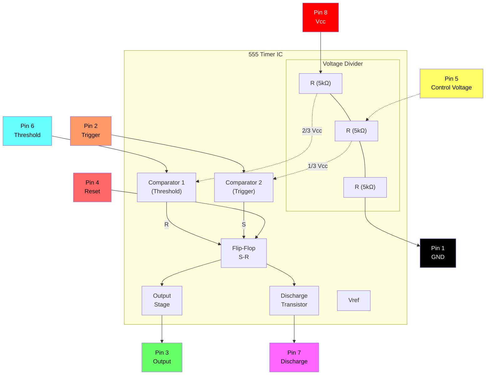
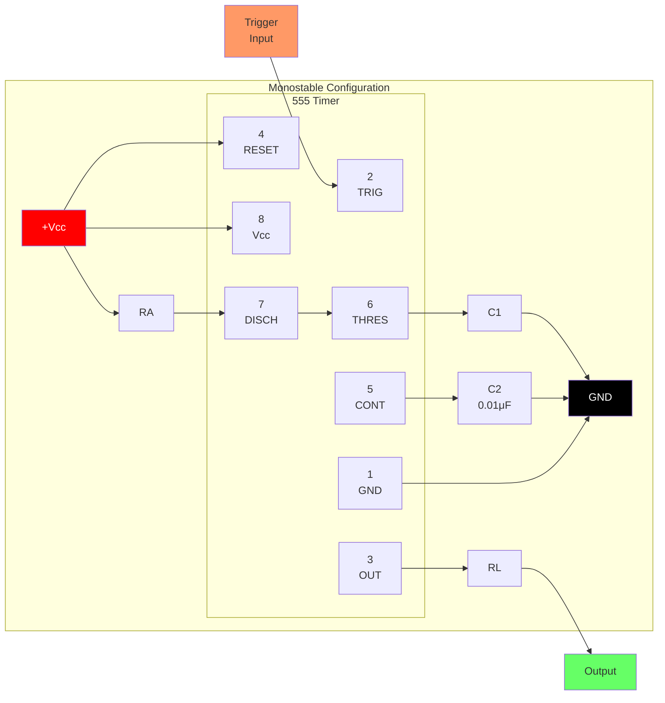
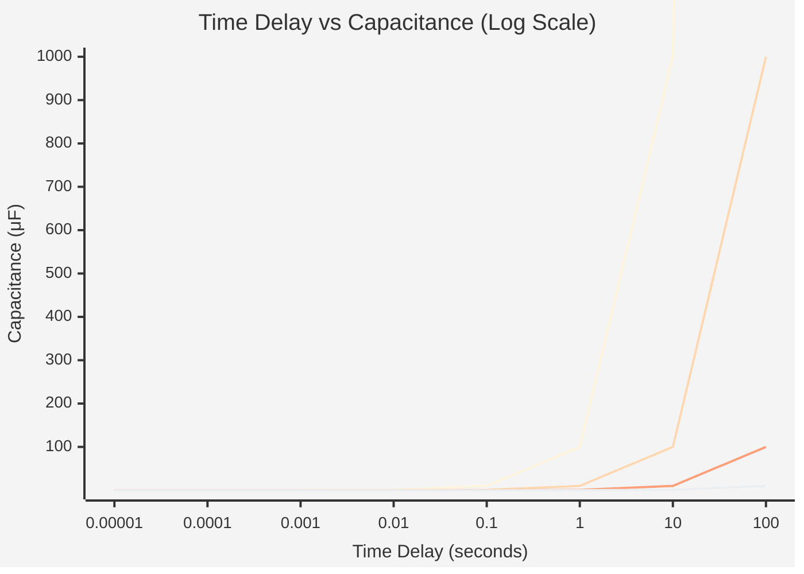
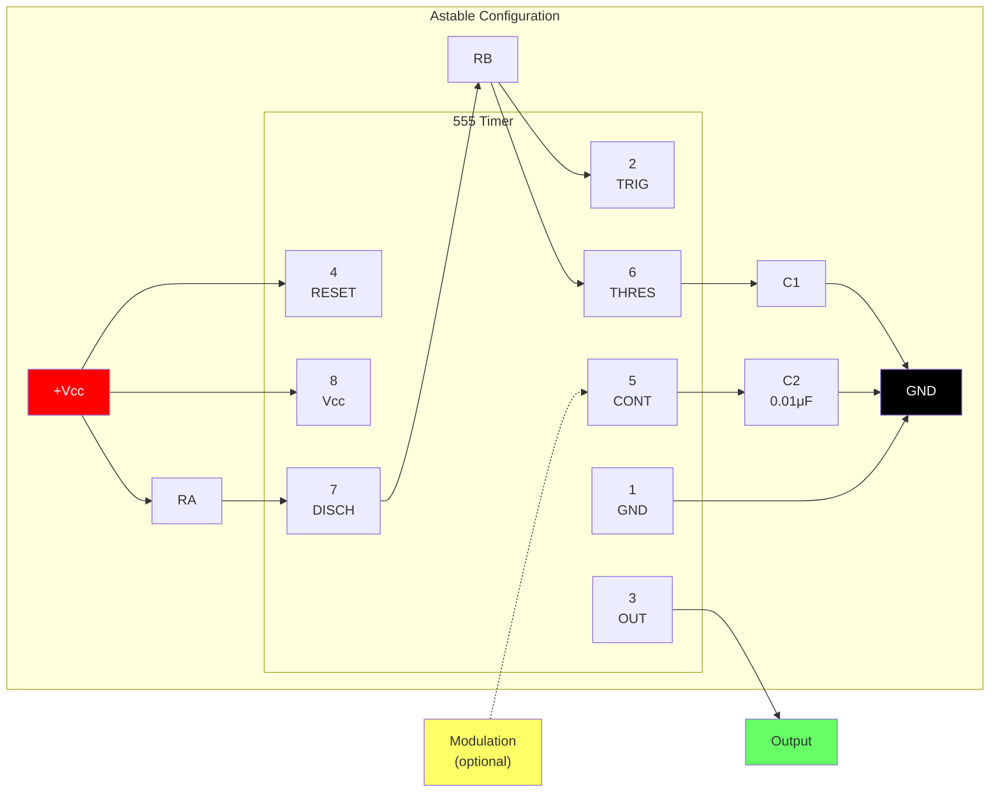
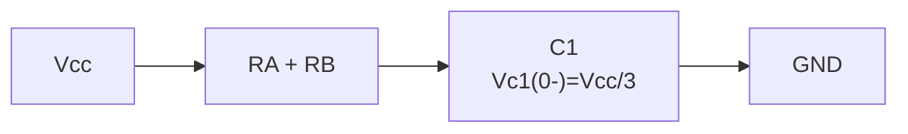

# 555

[www.fairchildsemi.com](www.fairchildsemi.com)

O LM555/NE555/SA555 e um controlador altamente estavel capaz de produzir pulsos de temporizacao precisos. Com operacao monoestavel, o atraso de tempo e controlado por um resistor externo e um capacitor. Com operacao astavel, a frequencia e o duty cycle sao controlados com precisao por dois resistores externos e um capacitor.

## Features

- High Current Drive Capability (200mA)
- Adjustable Duty Cycle
- Temperature Stability of 0.005%/°C
- Timing From μSec to Hours
- Turn off Time Less Than 2μSec

## Applications

- Precision Timing
- Pulse Generation
- Time Delay Generation
- Sequential Timing

## Internal Block Diagram



**Pin Configuration:**

| Pin | Name | Function |
|:---:|:---|:---|
| 1 | GND | Ground reference |
| 2 | TRIG | Trigger input (< 1/3 Vcc starts timing) |
| 3 | OUT | Saida (alta ou baixa) |
| 4 | RESET | Active low reset |
| 5 | CONT | Control voltage (2/3 Vcc reference) |
| 6 | THRES | Threshold input (> 2/3 Vcc ends timing) |
| 7 | DISCH | Discharge (open collector) |
| 8 | Vcc | Supply voltage (+4.5V to +16V) |

## Absolute Maximum Ratings (Ta = 25°C)

| Parameter | Symbol | Value | Unit |
| :--- | :--- | :--- | :--- |
| Supply Voltage | Vcc | 16 | V |
| Lead temperature (soldering 10 sec) | Tled | 300 | °C |
| Power Dissipation | PD | 600 | mW |
| Operating Temperature Range<br>LM555/NE555<br>SA555 | Topr | - 65 ~ + 150 | °C |

## Electrical Characteristics

(TA = 250C, vcc = 5 15V, unless otherwise specified)

| Parameter | Symbol | Conditions | Min. | Typ. | Max. | Unit |
| :--- | :--- | :--- | :--- |:--- | :--- | :--- |
| Supply Voltage | vcc | - | 4.5 | - | 16 | V |
| Supply Current (Low Stable) (Note 1) | Icc | Vcc = 5V, Rl = ∞<hr>Vcc = 15V, Rl = ∞ | -<hr>- | 3<hr>7.5 | 6<hr>15 | mA<hr>mA |
| Erro de Timing (Monostable)<br>Precisao Inicial (Note2)<br>Deriva com Temperatura (Note4)<br>Deriva com Tensão de Alimentacao (Note4)<br> | ACCUR<br>Δt/ΔT<br>Δt/ΔVcc | Ra = 1kΩ to100kΩ<br>C = 0.1μF | - | 1.0<br>50<br>0.1 | 3.0<br><br>0.5 | %<br>ppm/°C<br>%/V |
| Erro de Timing (Astable)<br>Precisao Inicial (Note2)<br>Deriva com Temperatura (Note4)<br>Deriva com Tensão de Alimentacao (Note4) | ACCUR<br>Δt/ΔT<br>Δt/ΔVcc | Ra = 1kΩ to 100kΩ<br> C = 0.1μF | - | 2.25<br>150<br>0.3 | - | %<br>ppm/°C<br>%/V |
| Control Voltage | Vc | Vcc = 15V<hr> Vcc = 5V | 9.0<hr>2.6 | 10.0<hr>3.33 | 11.0<hr>4.0 | V<hr>V |
| Threshold Voltage | VTH | VCC = 15V<hr>VCC = 5V | -<hr>- | 10.0<hr>3.33 | -<hr>- | V<hr>V |
| Threshold Current (Note3) | Ith | - | - | 0.1 | 0.25 | μA |
| Trigger Voltage | VTR | VCC = 5V<hr>VCC = 15V | 1.1<hr>4.5 | 1.67<hr>5 | 2.2<hr>5.6 | V<hr>V |
| Trigger Current | ITR | VTR = 0V | 0.01 | 2.0 | μA |
| Reset Voltage | VRST | - | 0.4 | 0.7 | 1.0 | V |
| Reset Current | IRST | - | 0.1 | 0.4 | mA |
| Low Output Voltage | VOL | VCC = 15V<br>ISINK = 10mA<br>ISINK = 50mA<hr>VCC = 5V<br>ISINK = 5mA | -<hr>- | 0.06<br>0.3<hr>0.05 | 0.25<br>0.75<hr>0.35 | V<br>V<hr>V |
| High Output Voltage | VOH | VCC = 15V<br>ISOURCE = 200mA<br>ISOURCE = 100mA<hr>VCC = 5V<br>ISOURCE = 100mA | 12.75<hr>2.75 | 12.5<br>13.3<hr>3.3 | -<hr>- | V<br>V<hr>V |
| Rise Time of Output (Note4) | tR | - | - | 100 | - | ns |
| Fall Time of Output (Note4) | tF | - | - | 100 | - | ns |
| Discharge Leakage Current | ILKG | - | - | 20 | 100 | nA |

**Notes:**

1. When the output is high. the supply current is typically 1mA less than at VCC = 5V.
2. Tested at VCC = 5.0V and VCC = 15V.
3. This will determine the maximum value of RA + RB for 15V operation, the max- total R = 20MQ. and for 5V operation, the max/
   - total R 8.7MΩ
4. These parameters, although guaranteed. are not 100% tested in production.

## Application Information

A Tabela 1 abaixo e a tabela basica de operacao do 555 timer:

| Threshold Voltage<br>(Vth)(PIN 6) | Trigger Voltage<br>(Vtr)(PIN 2) | Reset(PIN 4) | Output(PIN 3) | Discharging Tr.<br>(PIN 7) |
| :--- | :--- | :--- | :--- | :--- |
| Don't care | Don't care | Low | Low | ON |
| Vth > 2Vcc / 3 | Vth > 2Vcc / 3 | High | Low | ON |
| Vcc / 3 < Vth < 2 Vcc / 3 | Vcc / 3 < Vth < 2 Vcc / 3 | High | - | - |
| Vth < Vcc / 3 | Vth < Vcc / 3 | High | High | OFF |

Quando um sinal baixo e aplicado ao terminal de reset, a saida do timer permanece baixa independentemente da tensao de threshold ou trigger. Somente quando um sinal alto e aplicado ao terminal de reset, a saida do timer muda de acordo com a tensao de threshold e trigger. Quando a tensao de threshold excede 2/3 da tensao de alimentacao enquanto a saida do timer esta alta, o transistor de descarga interno (discharging Tr.) liga, reduzindo a tensao de threshold para abaixo de 1/3 da tensao de alimentacao. Durante esse tempo, a saida do timer e mantida baixa. Mais tarde, se um sinal baixo e aplicado a tensao de trigger de forma que ela fique em 1/3 da tensao de alimentacao, o transistor de descarga interno (discharging Tr.) desliga, aumentando a tensao de threshold e elevando novamente a saida do timer. Assim, o timer em modo monoestavel repete o processo acima. A Figura 2 mostra a relacao de constante de tempo baseada em RA e C. A Figura 3 mostra as formas de onda gerais durante a operacao monoestavel. Deve-se observar que, para operacao normal, a tensao do pulso de trigger precisa manter um minimo de Vcc/3 antes que a saida do timer fique baixa. Ou seja, embora a saida nao seja afetada mesmo que um pulso de trigger diferente seja aplicado enquanto a saida esta alta, ela pode ser afetada e a forma de onda nao operar corretamente se a tensao do pulso de trigger ao final do pulso de saida permanecer abaixo de Vcc/3. A Figura 4 mostra essa anomalia de saida.

### 1. Monostable Operation

#### Figure 1. Monostable Circuit



**Component Values:**

- RA: Timing resistor (1kΩ to 10MΩ typical)
- C1: Timing capacitor
- C2: Bypass capacitor (0.01μF recommended)
- RL: Load resistor

**Time Delay Formula:**
$$t_d = 1.1 \times R_A \times C_1$$

#### Figure 2. Resistance and Capacitance vs. Time Delay (td)



| RA | C1 | Time Delay (td) |
|:---|:---|:---|
| 1 kΩ | 0.1 μF | 110 μs |
| 10 kΩ | 0.1 μF | 1.1 ms |
| 100 kΩ | 0.1 μF | 11 ms |
| 1 MΩ | 1 μF | 1.1 s |
| 10 MΩ | 10 μF | 110 s |

#### Figure 3. Waveforms of Monostable Operation

```mermaid
%%{init: {'theme': 'base'}}%%
gantt
    title Monostable Waveforms (Normal Operation)
    dateFormat X
    axisFormat %s
    
    section Trigger
    High (Vcc)    :a1, 0, 2
    Low (<Vcc/3)  :crit, a2, 2, 3
    High (Vcc)    :a3, 3, 10
    
    section Output
    Low (0V)      :b1, 0, 2
    High (Vcc)    :active, b2, 2, 8
    Low (0V)      :b3, 8, 10
    
    section Threshold (Vc1)
    Charging      :c1, 2, 8
```



```
    Trigger ─────┐     ┌─────────────────────
    (Pin 2)      └─────┘  
                    ↓ Trigger pulse
                    
    Output  ─────────┐          ┌───────────
    (Pin 3)         └──────────┘
                    |←── td ───→|
                    
    Threshold        /‾‾‾‾‾‾‾‾\
    (Pin 6)    ─────/          \────────────
               0V  ↗            ↘  
                  Vcc/3      2Vcc/3
                  
    td = 1.1 × RA × C1
```

A Figura 1 ilustra um circuito monoestavel. Neste modo, o timer gera um pulso fixo sempre que a tensao de trigger cai abaixo de Vcc/3. Quando o pulso de trigger aplicado ao pino #2 cai abaixo de Vcc/3 enquanto a saida do timer esta baixa, o flip-flop interno desliga o transistor de descarga (discharging Tr.) e faz a saida do timer ficar alta carregando o capacitor externo C1 e setando a saida do flip-flop ao mesmo tempo. A tensao no capacitor externo C1, VC1, aumenta exponencialmente com a constante de tempo t=RA*C e atinge 2Vcc/3 em td=1.1RA*C. Portanto, o capacitor C1 e carregado pelo resistor RA. Quanto maior a constante de tempo RAC, mais tempo leva para VC1 atingir 2Vcc/3. Em outras palavras, a constante de tempo RAC controla a largura do pulso de saida. Quando a tensao aplicada ao capacitor C1 atinge 2Vcc/3, o comparador no terminal de trigger reseta o flip-flop, ligando o transistor de descarga. Nesse momento, C1 comeca a descarregar e a saida do timer muda para baixo. Assim, o timer em modo monoestavel repete o processo acima. A Figura 2 mostra a relacao da constante de tempo baseada em RA e C. A Figura 3 mostra as formas de onda gerais durante a operacao monoestavel. Deve-se observar que, para operacao normal, a tensao do pulso de trigger precisa manter um minimo de Vcc/3 antes que a saida do timer fique baixa. Ou seja, embora a saida permaneça inalterada mesmo que um pulso de trigger diferente seja aplicado enquanto a saida esta alta, ela pode ser afetada e a forma de onda nao operar corretamente se a tensao do pulso de trigger ao final do pulso de saida permanecer abaixo de Vcc/3. A Figura 4 mostra essa anomalia de saida.

#### Figure 4. Waveforms of Monostable Operation (abnormal)

```
    Trigger ─────┐  ┌──┐  ┌─────────────────
    (Pin 2)      └──┘  └──┘  
                 ↓     ↓ Retriggering during output high
                    
    Output  ─────────┐                ┌─────
    (Pin 3)         └────────────────┘
                    |←── extended td ──→|
                    
    Threshold        /‾‾‾‾‾‾‾‾‾‾‾‾‾‾‾‾\
    (Pin 6)    ─────/                  \────
               0V  ↗                    ↘  
                  Vcc/3              2Vcc/3

    ⚠️ ABNORMAL: Trigger held low extends output pulse!
    Trigger must return high before output goes low.
```

**Note:** Para operacao normal, a tensao do pulso de trigger deve retornar acima de Vcc/3 antes que a saida do timer fique baixa. Se o trigger permanecer abaixo de Vcc/3, o pulso de saida sera estendido de forma anormal.

### 2. Astable Operation

#### Figure 5. Astable Circuit



**Component Values:**

- RA: Charge resistor (controls HIGH time)
- RB: Charge/discharge resistor (affects both HIGH and LOW times)  
- C1: Timing capacitor
- C2: Bypass capacitor (0.01μF recommended)

**Timing Formulas:**

- High time: $t_H = 0.693 \times (R_A + R_B) \times C_1$
- Low time: $t_L = 0.693 \times R_B \times C_1$
- Period: $T = t_H + t_L = 0.693 \times (R_A + 2R_B) \times C_1$
- Frequency: $f = \frac{1.44}{(R_A + 2R_B) \times C_1}$
- Duty Cycle: $D = \frac{R_A + R_B}{R_A + 2R_B}$

#### Figure 6. Capacitance and Resistance vs. Frequency

```mermaid
%%{init: {'theme': 'base'}}%%
xychart-beta
    title "Free Running Frequency vs Capacitance"
    x-axis "Frequency (Hz)" [0.1, 1, 10, 100, 1000, 10000, 100000]
    y-axis "Capacitance (μF)" 0.001 --> 100
```

| (RA + 2RB) | C1 | Frequency |
|:---|:---|:---|
| 1.44 kΩ | 1 μF | 1 kHz |
| 14.4 kΩ | 1 μF | 100 Hz |
| 144 kΩ | 1 μF | 10 Hz |
| 14.4 kΩ | 0.1 μF | 1 kHz |
| 14.4 kΩ | 0.01 μF | 10 kHz |

#### Figure 7. Waveforms of Astable Operation

```
    Output  ────┐     ┌─────┐     ┌─────┐     ┌────
    (Pin 3)    └─────┘     └─────┘     └─────┘
               |←tL→|←─tH─→|←tL→|←─tH─→|
               
    Threshold       /\        /\        /\
    (Pin 6)   ─────/  \──────/  \──────/  \──────
              Vcc/3    2Vcc/3
              
              ├────── T ──────┤
              T = tH + tL = 0.693(RA + 2RB)C1
              
    Charging:   C1 charges through RA + RB
    Discharging: C1 discharges through RB only
```

**Typical Values:** RA = 1kΩ, RB = 1kΩ, C1 = 1μF, Vcc = 5V

A operacao astavel do timer e alcançada adicionando o resistor RB a Figura 1 e configurando conforme a Figura 5. Na operacao astavel, o terminal de trigger e o terminal de threshold estao conectados de forma a formar um self-trigger, operando como um multivibrador. Quando a saida do timer esta alta, o transistor de descarga interno (discharging Tr.) desliga e a VC1 aumenta por funcao exponencial com a constante de tempo (RA+RB)*C. Quando a VC1, ou a tensao de threshold, atinge 2Vcc/3, a saida do comparador no terminal de trigger fica alta, resetando o F/F e fazendo a saida do timer ficar baixa. Isso por sua vez liga o transistor de descarga e o C1 descarrega pelo canal de descarga formado por RB e o transistor de descarga. Quando a VC1 cai abaixo de Vcc/3, a saida do comparador no terminal de trigger fica alta e a saida do timer volta a ficar alta. O transistor de descarga desliga e a VC1 volta a subir. Nesse processo, a secao em que a saida do timer esta alta e o tempo que a VC1 leva para subir de Vcc/3 a 2Vcc/3, e a secao em que a saida do timer esta baixa e o tempo que a VC1 leva para descer de 2Vcc/3 a Vcc/3. Quando a saida do timer esta alta, o circuito equivalente de carga do capacitor C1 e o seguinte:

#### Equation 1: Charging Circuit Equivalent

