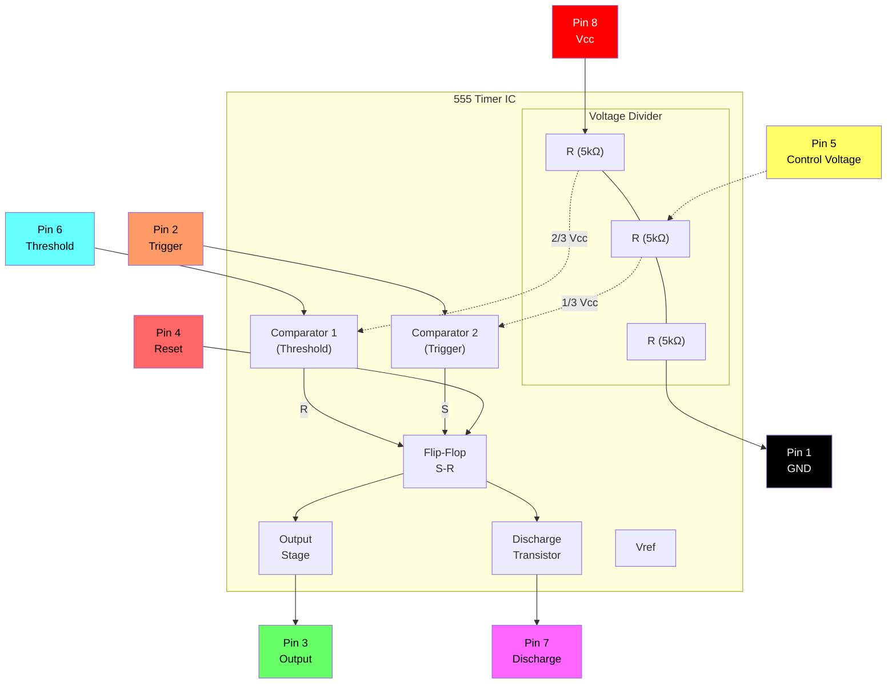

# Connecting Electronic Components

Este guia fornece instrucoes passo a passo para montar circuitos eletricos em uma breadboard. Cada montagem introduz novos componentes e conceitos de forma progressiva.

---

## Basic Component Build Instructions

### Build 1 — Single LED

**Components:** Red LED, black jumper wire, red jumper wire, battery with holder

**Passos:**

1. Insira o black jumper wire na breadboard de **A5** ate **A14**.
2. Insira o red jumper wire na breadboard de **J5** ate **J14**.
3. Coloque o red LED na linha 14 com a perna positiva (a mais longa) do lado direito, alinhada ao red wire, e a perna negativa do lado esquerdo, alinhada ao black wire.
4. Insira a bateria no holder e coloque-o na breadboard, conectando negativo ao black e positivo ao red.

**Result:** Ao inserir a bateria, o LED acende.

**Solucao de Problemas:**

- O LED esta invertido?
- Os jumper wires estao na mesma linha dos terminais do LED?
- Os jumper wires estao na mesma linha dos terminais da bateria?

---

### Build 2 — Single Push Button

**Components:** Red LED, push button, black jumper wire, red jumper wire, battery with holder

**Passos:**

1. Insira o black jumper wire na breadboard de **A5** ate **A16**.
2. Insira o red jumper wire na breadboard de **J5** ate **J12**.
3. Coloque o red LED na breadboard com a perna positiva (a mais longa) em **H15** e a perna negativa em **G17**.
4. Posicione o push button horizontalmente no meio da breadboard de modo que o pino inferior esquerdo fique na linha 16 (alinhado ao black jumper wire) e o pino superior direito na linha 14 (alinhado a perna negativa do red LED).
5. Insira a bateria no holder e coloque-o na breadboard, conectando negativo ao black e positivo ao red.

**Result:** Ao pressionar o push button, o LED acende.

**Solucao de Problemas:**

- O LED esta invertido?
- Os jumper wires estao na mesma linha dos terminais do LED?
- Os jumper wires estao na mesma linha dos terminais da bateria?

---

### Build 3 — Photoresistor-Dimmed LED

**Components:** Green LED, photoresistor, black jumper wire, red jumper wire, battery with holder

**Passos:**

1. Insira o black jumper wire na breadboard de **A5** ate **A12**.
2. Insira o red jumper wire na breadboard de **J5** ate **J13**.
3. Coloque o green LED na breadboard com a perna positiva (a mais longa) em **F13** e a perna negativa em **E13**.
4. Insira o photoresistor na breadboard de **C12** ate **D13**.
5. Insira a bateria no holder e coloque-o na breadboard, conectando negativo ao black e positivo ao red.

**Result:** Ao inserir a bateria, o LED acende. Cobrir o photoresistor faz o LED diminuir o brilho.

---

### Build 4 — Double LED Push Button

**Components:** Red LED, green LED, 220Ω resistor, push button, black jumper wire, red jumper wire, battery with holder

**Passos:**

1. Insira o black jumper wire na breadboard de **A5** ate **A11**.
2. Insira o red jumper wire na breadboard de **J5** ate **J11**.
3. Insira o resistor de 220Ω na breadboard de **I11** ate **I15**.
4. Posicione o push button horizontalmente no meio da breadboard de modo que os pinos superiores fiquem na linha 15 e em lados opostos da breadboard.
5. Coloque o red LED na breadboard com a perna positiva (a mais longa) em **C17** e a perna negativa em **B11**.
6. Coloque o green LED na breadboard com a perna positiva em **G15** e a perna negativa em **E11**.
7. Insira a bateria no holder e coloque-o na breadboard, conectando negativo ao black e positivo ao red.

**Result:** Ao inserir a bateria, o green LED acende. Ao pressionar o push button, o green LED apaga e o red LED acende.

### Build 5 - Photoresistor Blinking LEDs

- Insira o black jumper wire na breadboard de A3 ate A12.
- Insira o red jumper wire na breadboard de J3 ate J12.
- Posicione o chip 555 no meio da breadboard com os pinos superiores na linha 12.
- Insira um jumper wire conectando D15 a G12.
- Insira um jumper wire conectando D13 a G14.
- Insira o resistor de 1000Ω na breadboard de C14 ate H17.
- Insira o photoresistor na breadboard de B14 ate B15.
- Insira o capacitor na breadboard de A13 ate B12.
- Coloque o green LED na breadboard com a perna positiva (a mais longa) em F17 e a perna negativa em C12.
- Coloque o red LED na breadboard com a perna positiva em I12 e a perna negativa em J17.
- Insira a bateria no holder e coloque-o na breadboard, conectando negativo ao black e positivo ao red.

Ao inserir a bateria, os dois LEDs comecam a piscar rapidamente. Cobrir o photoresistor da luz diminui a frequencia de piscada dos LEDs.

---

## 555 Timer IC Reference

O 555 timer e um circuito integrado versatil usado em temporizacao, geracao de pulsos e osciladores. As secoes a seguir fornecem informacoes de pinout e detalhes do circuito interno.

### 555 Pinout Diagram

```
    ┌─────────────────────────────────────┐
    │  ●                                  │
    │  #1                             #8  │
    │  ┌──┐                         ┌──┐  │
    │  │  │                         │  │  │
    │  └──┘                         └──┘  │
    │  #2                             #7  │
    │  ┌──┐       555 TIMER         ┌──┐  │
    │  │  │                         │  │  │
    │  └──┘                         └──┘  │
    │  #3                             #6  │
    │  ┌──┐                         ┌──┐  │
    │  │  │                         │  │  │
    │  └──┘                         └──┘  │
    │  #4                             #5  │
    │  ┌──┐                         ┌──┐  │
    │  │  │                         │  │  │
    │  └──┘                         └──┘  │
    └─────────────────────────────────────┘
```

### 555 Pin Descriptions

| Pin | Symbol | Function |
|:---:|:---:|:---|
| 1 | GND | Ground reference (0V) |
| 2 | TRIG | Trigger input — starts timing cycle when voltage drops below ⅓ Vcc |
| 3 | OUT | Output — provides high or low signal |
| 4 | RESET | Reset input (active low) — forces output low when grounded |
| 5 | CONT | Control voltage — provides access to internal voltage divider (⅔ Vcc) |
| 6 | THRES | Threshold input — ends timing cycle when voltage exceeds ⅔ Vcc |
| 7 | DISCH | Discharge — open collector output for discharging timing capacitor |
| 8 | Vcc | Supply voltage (+4.5V to +16V) |

### 555 Internal Block Diagram



---

### Build 6 — Push Button Buzzer

**Components:** 555 timer IC, piezo speaker, 220Ω resistor, 1000Ω resistor, capacitor, push button, jumper wires, battery with holder

**Passos:**

1. Insira o black jumper wire na breadboard de **A1** ate **A11**.
2. Insira o red jumper wire na breadboard de **J1** ate **J11**.
3. Posicione o chip 555 no meio da breadboard com os pinos superiores na linha 11.
4. Insira um jumper wire conectando **D12** a **G13**.
5. Insira um jumper wire conectando **D14** a **G11**.
6. Insira o capacitor na breadboard de **A12** ate **B11**.
7. Insira o resistor de 220Ω na breadboard de **C12** ate **C13**.
8. Posicione o push button horizontalmente no meio da breadboard de modo que os pinos superiores estejam na linha 15 e em lados opostos da breadboard.
9. Insira o piezo speaker na breadboard com o pino positivo em **A9** e o pino negativo em **A6**.
10. Insira o resistor de 1000Ω na breadboard de **E6** ate **A13**.
11. Insira um jumper wire conectando **C9** a **D15**.
12. Insira um jumper wire conectando **G17** a **I11**.
13. Insira a bateria no holder e coloque-o na breadboard, conectando negativo ao black e positivo ao red.

**Result:** Ao pressionar o push button, o buzzer soara.

---

### Build 7 — Photoresistor Theremin

**Components:** 555 timer IC, piezo speaker, photoresistor, 1000Ω resistor, capacitor, push button, jumper wires, battery with holder

**Passos:**

1. Insira o black jumper wire na breadboard de **A1** ate **A11**.
2. Insira o red jumper wire na breadboard de **J1** ate **J11**.
3. Posicione o chip 555 no meio da breadboard com os pinos superiores na linha 11.
4. Insira um jumper wire conectando **D12** a **G13**.
5. Insira um jumper wire conectando **D14** a **G11**.
6. Insira o capacitor na breadboard de **A12** ate **B11**.
7. Insira o photoresistor na breadboard de **C12** ate **C13**.
8. Posicione o push button horizontalmente no meio da breadboard de modo que os pinos superiores estejam na linha 15 e em lados opostos da breadboard.
9. Insira o piezo speaker na breadboard com o pino positivo em **A9** e o pino negativo em **A6**.
10. Insira o resistor de 1000Ω na breadboard de **E6** ate **A13**.
11. Insira um jumper wire conectando **C9** a **D15**.
12. Insira um jumper wire conectando **G17** a **I11**.
13. Insira a bateria no holder e coloque-o na breadboard, conectando negativo ao black e positivo ao red.

**Result:** Ao pressionar o push button, o buzzer soara. Cobrir o photoresistor altera o pitch do buzzer.

---

### Build 8 — Potentiometer-Dimmed LED

**Components:** Green LED, potentiometer, 220Ω resistor, black jumper wire, red jumper wire, battery with holder

**Passos:**

1. Insira o black jumper wire na breadboard de **A1** ate **A13**.
2. Insira o red jumper wire na breadboard de **J1** ate **J9**.
3. Posicione o potentiometer com o lado de dois pinos a esquerda, pino superior em **E13** e pino inferior em **E15**.
4. Insira o resistor de 220Ω na breadboard de **H9** ate **H14**.
5. Coloque o green LED na breadboard com a perna positiva (a mais longa) em **C15** e a perna negativa em **B13**.
6. Insira a bateria no holder e coloque-o na breadboard, conectando negativo ao black e positivo ao red.

**Result:** Ao inserir a bateria, o LED acende. Girar o potentiometer aumenta ou diminui o brilho do LED.

---

### Build 9 — Push Button RGB LED

**Components:** RGB LED (common cathode), three push buttons, two 220Ω resistors, black jumper wire, red jumper wire, jumper wires, battery with holder

**Passos:**

1. Insira o black jumper wire na breadboard de **A1** ate **B7**.
2. Insira o red jumper wire na breadboard de **J1** ate **J7**.
3. Insira o RGB LED na breadboard de **A4** ate **A8**. A perna mais longa das quatro e o ground e deve ficar em **A7**.
4. Posicione tres push buttons horizontalmente no meio da breadboard com pinos em:
   - Button 1: **E9–F9** e **E11–F11**
   - Button 2: **E12–F12** e **E14–F14**
   - Button 3: **E15–F15** e **E17–F17**
5. Insira um jumper wire conectando **C5** a **D9**.
6. Insira um jumper wire conectando **C6** a **C12**.
7. Insira um jumper wire conectando **B8** a **B15**.
8. Insira o primeiro resistor de 220Ω na breadboard de **G7** ate **G11**.
9. Insira o segundo resistor de 220Ω na breadboard de **H7** ate **H14**.
10. Insira a bateria no holder e coloque-o na breadboard, conectando negativo ao black e positivo ao red.

**Result:** Pressionar cada push button ativa um canal de cor diferente do RGB LED.

---

### Build 10 — Potentiometer-Controlled Buzzer

**Components:** 555 timer IC, piezo speaker, potentiometer, 220Ω resistor, capacitor, push button, jumper wires, battery with holder

**Passos:**

1. Insira o black jumper wire na breadboard de **A1** ate **A11**.
2. Insira o red jumper wire na breadboard de **J1** ate **J11**.
3. Posicione o chip 555 no meio da breadboard com os pinos superiores na linha 11.
4. Insira um jumper wire conectando **D12** a **G13**.
5. Insira um jumper wire conectando **D14** a **G11**.
6. Insira o capacitor na breadboard de **A12** ate **B11**.
7. Insira o piezo speaker na breadboard de **A6** ate **A9** (coloque o positivo embaixo).
8. Posicione o push button horizontalmente no meio da breadboard de modo que os pinos superiores estejam em **E15** e **F15**.
9. Insira o resistor de 220Ω na breadboard de **E6** ate **A13**.
10. Insira um jumper wire conectando **E9** a **D15**.
11. Insira um jumper wire conectando **G17** a **I11**.
12. Posicione o potentiometer com o lado de dois pinos a direita, pino superior em **F7** e pino inferior em **F9**.
13. Insira um jumper wire conectando **D8** a **B13**.
14. Insira um jumper wire conectando **H7** a **C12**.
15. Insira um jumper wire conectando **H9** a **D11**.
16. Insira a bateria no holder e coloque-o na breadboard, conectando negativo ao black e positivo ao red.

**Result:** Pressionar o push button faz o buzzer soar. Girar o potentiometer altera o pitch do buzzer.
