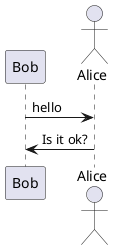
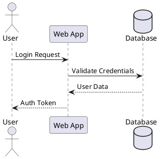
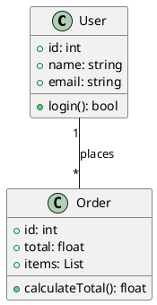
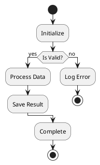
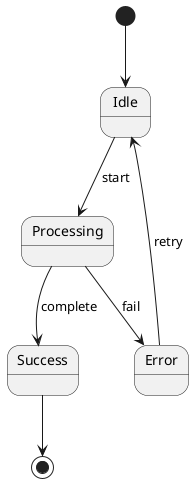
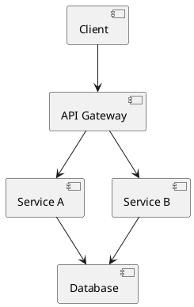
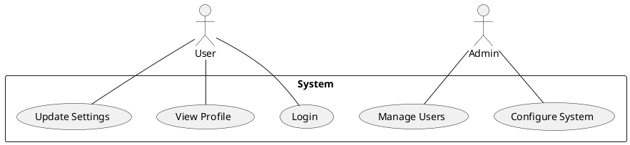
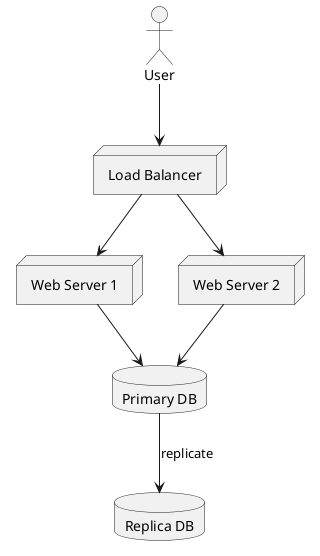

# Gerador de Diagramas ASCII Art com PlantUML

## Visao Geral

Crie diagramas ASCII art baseados em texto usando PlantUML. Perfeito para documentacao em ambientes de terminal, arquivos README, emails ou qualquer cenario onde diagramas graficos nao sao adequados.

## O que e ASCII Art do PlantUML?

PlantUML pode gerar diagramas como texto puro (ASCII art) em vez de imagens. Isso e util para:

- Workflows baseados em terminal
- Commits/PRs no Git sem suporte a imagens
- Documentacao que precisa de versionamento
- Ambientes onde ferramentas graficas nao estao disponiveis

## Instalacao

```bash
# macOS
brew install plantuml

# Linux (varia por distro)
sudo apt-get install plantuml  # Ubuntu/Debian
sudo yum install plantuml      # RHEL/CentOS

# Or download JAR directly
wget https://github.com/plantuml/plantuml/releases/download/v1.2024.0/plantuml-1.2024.0.jar
```

## Formatos de Saida

| Flag    | Formato        | Descricao                          |
| ------- | ------------- | ------------------------------------ |
| `-txt`  | ASCII         | Caracteres ASCII puros               |
| `-utxt` | Unicode ASCII | Melhorado com caracteres de box-drawing |

## Workflow Basico

### 1. Criar Arquivo de Diagrama PlantUML



### 2. Gerar ASCII Art

```bash
# Standard ASCII output
plantuml -txt diagram.puml

# Unicode-enhanced output (better looking)
plantuml -utxt diagram.puml

# Using JAR directly
java -jar plantuml.jar -txt diagram.puml
java -jar plantuml.jar -utxt diagram.puml
```

### 3. Ver a Saida

A saida e salva como `diagram.atxt` (ASCII) ou `diagram.utxt` (Unicode).

## Tipos de Diagramas Suportados

### Diagrama de Sequencia



### Diagrama de Classes



### Diagrama de Atividades



### Diagrama de Estados



### Diagrama de Componentes



### Diagrama de Caso de Uso



### Diagrama de Deployment


