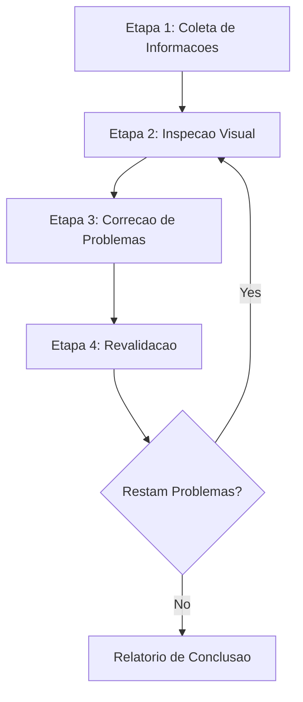
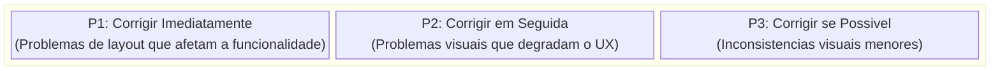
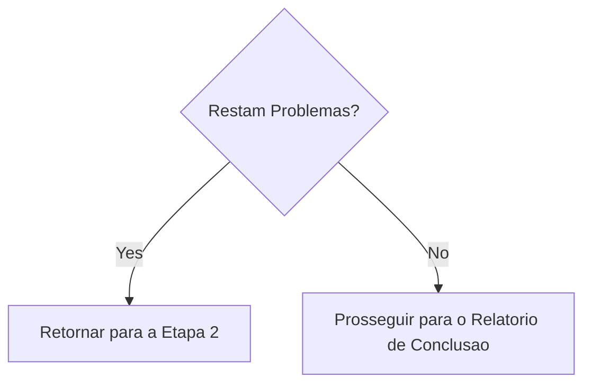

# Web Design Reviewer

Esta skill permite a inspecao e validacao visual da qualidade do design de sites, identificando e corrigindo problemas no nivel de codigo-fonte.

## Escopo de Aplicacao

- Sites estaticos (HTML/CSS/JS)
- Frameworks SPA como React / Vue / Angular / Svelte
- Frameworks full-stack como Next.js / Nuxt / SvelteKit
- Plataformas CMS como WordPress / Drupal
- Qualquer outra aplicacao web

## Pre-requisitos

### Obrigatorios

1. **O site alvo deve estar em execucao**
   - Servidor de desenvolvimento local (ex.: `http://localhost:3000`)
   - Ambiente de staging
   - Ambiente de producao (para revisoes somente leitura)

2. **Automacao de navegador deve estar disponivel**
   - Captura de screenshot
   - Navegacao de paginas
   - Recuperacao de informacoes do DOM

3. **Acesso ao codigo-fonte (ao corrigir)**
   - O projeto deve existir no workspace

## Visao Geral do Fluxo



---

## Etapa 1: Fase de Coleta de Informacoes

### 1.1 Confirmacao de URL

Se a URL nao for fornecida, pergunte ao usuario:

> Please provide the URL of the website to review (e.g., `http://localhost:3000`)

### 1.2 Compreensao da Estrutura do Projeto

Ao corrigir problemas, colete as seguintes informacoes:

| Item | Exemplo de pergunta |
|------|---------------------|
| Framework | Are you using React / Vue / Next.js, etc.? |
| Metodo de estilo | CSS / SCSS / Tailwind / CSS-in-JS, etc. |
| Localizacao do codigo | Where are style files and components located? |
| Escopo da revisao | Specific pages only or entire site? |

### 1.3 Deteccao Automatica do Projeto

Tente detectar automaticamente a partir de arquivos no workspace:

```
Detection targets:
├── package.json     → Framework and dependencies
├── tsconfig.json    → TypeScript usage
├── tailwind.config  → Tailwind CSS
├── next.config      → Next.js
├── vite.config      → Vite
├── nuxt.config      → Nuxt
└── src/ or app/     → Source directory
```

### 1.4 Identificacao do Metodo de Estilo

| Metodo | Deteccao | Alvo de edicao |
|--------|----------|----------------|
| Pure CSS | `*.css` files | Global CSS or component CSS |
| SCSS/Sass | `*.scss`, `*.sass` | SCSS files |
| CSS Modules | `*.module.css` | Module CSS files |
| Tailwind CSS | `tailwind.config.*` | className in components |
| styled-components | `styled.` in code | JS/TS files |
| Emotion | `@emotion/` imports | JS/TS files |
| CSS-in-JS (other) | Inline styles | JS/TS files |

---

## Etapa 2: Fase de Inspecao Visual

### 2.1 Navegacao de Paginas

1. Navegue para a URL especificada
2. Capture screenshots
3. Recupere a estrutura/snapshot do DOM (se possivel)
4. Se houver paginas adicionais, percorra a navegacao

### 2.2 Itens de Inspecao

#### Problemas de Layout

| Problema | Descricao | Severidade |
|----------|-----------|------------|
| Element Overflow | Conteudo transborda do elemento pai ou viewport | Alta |
| Element Overlap | Sobreposicao nao intencional de elementos | Alta |
| Alignment Issues | Problemas de alinhamento em grid ou flex | Media |
| Inconsistent Spacing | Inconsistencias de padding/margin | Media |
| Text Clipping | Texto longo nao tratado corretamente | Media |

#### Problemas de Responsividade

| Problema | Descricao | Severidade |
|----------|-----------|------------|
| Non-mobile Friendly | Layout quebra em telas pequenas | Alta |
| Breakpoint Issues | Transicoes artificiais ao mudar o tamanho da tela | Media |
| Touch Targets | Botoes muito pequenos no mobile | Media |

#### Problemas de Acessibilidade

| Problema | Descricao | Severidade |
|----------|-----------|------------|
| Insufficient Contrast | Baixa taxa de contraste entre texto e fundo | Alta |
| No Focus State | Estado nao identificavel na navegacao por teclado | Alta |
| Missing alt Text | Imagens sem texto alternativo | Media |

#### Consistencia Visual

| Problema | Descricao | Severidade |
|----------|-----------|------------|
| Font Inconsistency | Familias tipograficas misturadas | Media |
| Color Inconsistency | Cores de marca nao unificadas | Media |
| Spacing Inconsistency | Espacamento nao uniforme entre elementos similares | Baixa |

### 2.3 Teste de Viewport (Responsivo)

Teste nos seguintes viewports:

| Nome | Largura | Dispositivo representativo |
|------|---------|----------------------------|
| Mobile | 375px | iPhone SE/12 mini |
| Tablet | 768px | iPad |
| Desktop | 1280px | Standard PC |
| Wide | 1920px | Large display |

---

## Etapa 3: Fase de Correcao de Problemas

### 3.1 Priorizacao de Problemas



### 3.2 Identificacao de Arquivos de Origem

Identifique os arquivos de origem a partir dos elementos com problema:

1. **Busca baseada em seletores**
   - Pesquise no codebase por classe ou ID
   - Explore definicoes de estilo com `grep_search`

2. **Busca baseada em componentes**
   - Identifique componentes pelo texto ou estrutura do elemento
   - Explore arquivos relacionados com `semantic_search`

3. **Filtro por padroes de arquivo**
   ```
   Style files: src/**/*.css, styles/***
   Components: src/components/***
   Pages: src/pages/**, app/**
   ```

### 3.3 Aplicacao de Correcoes

#### Diretrizes de Correcao por Framework

Veja [references/framework-fixes.md](references/framework-fixes.md) para detalhes.

#### Principios de Correcao

1. **Mudancas minimas**: faca apenas o minimo necessario para resolver o problema
2. **Respeite padroes existentes**: siga o estilo de codigo do projeto
3. **Evite mudancas disruptivas**: tome cuidado para nao afetar outras areas
4. **Adicione comentarios**: explique o motivo das correcoes quando apropriado

---

## Etapa 4: Fase de Revalidacao

### 4.1 Confirmacao Pos-Correcao

1. Recarregue o navegador (ou aguarde o HMR do servidor de dev)
2. Capture screenshots das areas corrigidas
3. Compare antes e depois

### 4.2 Teste de Regressao

- Verifique se as correcoes nao afetaram outras areas
- Confirme que a exibicao responsiva nao quebrou

### 4.3 Decisao de Iteracao



**Limite de iteracoes**: se mais de 3 tentativas forem necessarias para um problema especifico, consulte o usuario

---

## Formato de Saida

### Relatorio de Resultados da Revisao

```markdown
# Web Design Review Results

## Summary

| Item | Value |
|------|-------|
| Target URL | {URL} |
| Framework | {Detected framework} |
| Styling | {CSS / Tailwind / etc.} |
| Tested Viewports | Desktop, Mobile |
| Issues Detected | {N} |
| Issues Fixed | {M} |

## Detected Issues

### [P1] {Issue Title}

- **Page**: {Page path}
- **Element**: {Selector or description}
- **Issue**: {Detailed description of the issue}
- **Fixed File**: `{File path}`
- **Fix Details**: {Description of changes}
- **Screenshot**: Before/After

### [P2] {Issue Title}
...

## Unfixed Issues (if any)

### {Issue Title}
- **Reason**: {Why it was not fixed/could not be fixed}
- **Recommended Action**: {Recommendations for user}

## Recommendations

- {Suggestions for future improvements}
```

---

## Capacidades Necessarias

| Capacidade | Descricao | Necessaria |
|------------|-----------|------------|
| Web Page Navigation | Acesso a URLs, transicoes de paginas | ✅ |
| Screenshot Capture | Captura de imagem da pagina | ✅ |
| Image Analysis | Deteccao de problemas visuais | ✅ |
| DOM Retrieval | Recuperacao da estrutura da pagina | Recomendado |
| File Read/Write | Leitura e edicao de codigo-fonte | Necessario para correcoes |
| Code Search | Busca no codigo do projeto | Necessario para correcoes |

---

## Implementacao de Referencia

### Implementacao com Playwright MCP

[Playwright MCP](https://github.com/microsoft/playwright-mcp) e recomendado como implementacao de referencia para esta skill.

| Capacidade | Playwright MCP Tool | Proposito |
|------------|---------------------|-----------|
| Navigation | `browser_navigate` | Acesso a URLs |
| Snapshot | `browser_snapshot` | Recupera a estrutura do DOM |
| Screenshot | `browser_take_screenshot` | Imagens para inspecao visual |
| Click | `browser_click` | Interagir com elementos interativos |
| Resize | `browser_resize` | Teste responsivo |
| Console | `browser_console_messages` | Detectar erros de JS |

#### Exemplo de Configuracao (MCP Server)

```json
{
  "mcpServers": {
    "playwright": {
      "command": "npx",
      "args": ["-y", "@playwright/mcp@latest", "--caps=vision"]
    }
  }
}
```

### Outras Ferramentas de Automacao Compatíveis

| Ferramenta | Recursos |
|------------|----------|
| Selenium | Amplo suporte a navegadores, suporte multi-linguagem |
| Puppeteer | Focado em Chrome/Chromium, Node.js |
| Cypress | Integracao facil com testes E2E |
| WebDriver BiDi | Protocolo padronizado de nova geracao |

O mesmo fluxo pode ser implementado com essas ferramentas. Desde que oferecam as capacidades necessarias (navegacao, screenshot, recuperacao de DOM), a escolha da ferramenta e flexivel.

---

## Boas Praticas

### DO (Recomendado)

- ✅ Sempre salve screenshots antes de corrigir
- ✅ Corrija um problema por vez e valide cada um
- ✅ Siga o estilo de codigo existente no projeto
- ✅ Confirme com o usuario antes de mudancas maiores
- ✅ Documente detalhes das correcoes de forma completa

### DON'T (Nao Recomendado)

- ❌ Refatoracao em larga escala sem confirmacao
- ❌ Ignorar design system ou diretrizes de marca
- ❌ Correcoes que ignoram performance
- ❌ Corrigir multiplos problemas de uma vez (dificil de validar)

---

## Solucao de Problemas

### Problema: Arquivos de estilo nao encontrados

1. Verifique dependencias em `package.json`
2. Considere a possibilidade de CSS-in-JS
3. Considere CSS gerado em build
4. Pergunte ao usuario sobre o metodo de estilo

### Problema: Correcoes nao refletem

1. Verifique se o HMR do servidor de dev esta funcionando
2. Limpe o cache do navegador
3. Rebuild se o projeto exigir build
4. Verifique problemas de especificidade de CSS

### Problema: Correcoes afetando outras areas

1. Reverter mudancas
2. Usar seletores mais especificos
3. Considerar CSS Modules ou estilos com escopo
4. Consultar o usuario para confirmar o impacto
